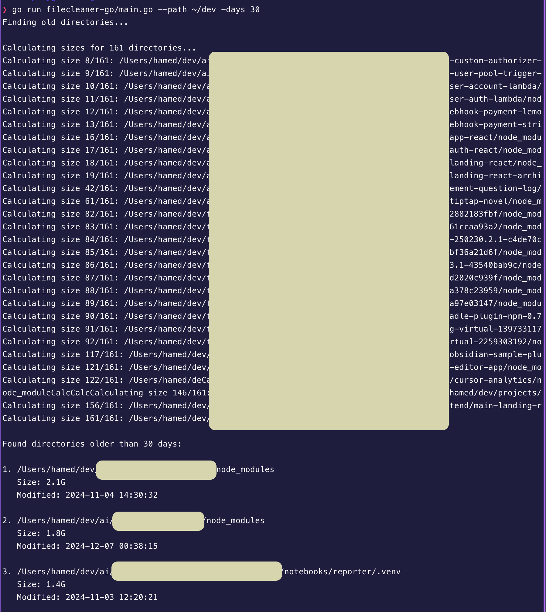

# DevDetox 🧹

A Go utility that helps identify and clean up old `node_modules`, `.venv`, and `.env` directories that are taking up space on your system. It finds directories older than a specified age, calculates their sizes, and deletes them. The logs are exported to a CSV file.

## Features

- 🔍 Finds old `node_modules`, `.venv`, and `.env` directories
- 📊 Calculates directory sizes using `du`
- 📝 Exports results to CSV for record keeping
- 🗑️ Interactive deletion with support for single, multiple, or all directories
- 💪 Handles large directory structures efficiently
- ✨ Progress indication for long operations

## Requirements

- Go 1.x
- Unix-like system (Linux/macOS) with `du` command available

## Installation

```bash
# Clone the repository
git clone https://github.com/hamedmp/devdetox
cd devdetox

# Build the binary
go build -o devdetox

# Optional: Move to a directory in your PATH (Linux/macOS)
sudo mv devdetox /usr/local/bin/
```

## Quick Start

```bash
# Run directly after building
./devdetox -path /your/path -days 30

# Or if installed to PATH
devdetox -path /your/path -days 30

# Or run it without building
go run main.go -path /your/path
```

## Usage

Basic usage:

```bash
./devdetox -path /path/to/search -days 30
```

Arguments:

- `-path`: Starting directory for the search (required)
- `-days`: Minimum age in days for directories (default: 30)

The tool will:

1. Scan for matching directories older than specified days
2. Calculate sizes for found directories
3. Generate a CSV report with timestamps
4. Offer interactive deletion options

## Running as a Cron Job

To run automated scans (without interactive deletion), you can set up a cron job:

1. Create a shell script `cleanup_scan.sh`:

```bash
#!/bin/bash
SCAN_PATH="/your/search/path"
OUTPUT_DIR="/path/to/store/reports"

cd /path/to/devdetox
./devdetox -path "$SCAN_PATH" > "$OUTPUT_DIR/scan_$(date +\%Y\%m\%d).log" 2>&1
```

2. Make it executable:

```bash
chmod +x cleanup_scan.sh
```

3. Add to crontab (runs every Monday at 2 AM):

```bash
0 2 * * 1 /path/to/cleanup_scan.sh
```

Edit crontab with:

```bash
crontab -e
```

## Output

The tool generates a CSV file named `cleanup_TIMESTAMP.csv` containing:

- Full path to directory
- Size (human-readable)
- Last modified date

## Example

I cleaned 43 GBs of old node_modules and .venv directories on my mac.



```bash
$ ./dircleanup -path /Users/me/projects -days 60

Finding old directories...
Calculating sizes for 15 directories...

Found directories older than 60 days:

1. /Users/me/projects/old-project/node_modules
   Size: 1.2G
   Modified: 2023-12-01 15:04:05

2. /Users/me/projects/legacy-app/.venv
   Size: 234M
   Modified: 2023-11-15 10:30:00

Results written to: cleanup_2024-03-15_150405.csv
```

## License

MIT License - See LICENSE file for details

## Contributing

Pull requests are welcome! For major changes, please open an issue first to discuss what you would like to change.

# Initialize the module

go mod init github.com/hamedmp/devdetox

# Tidy up dependencies (though you might not have any external ones)

go mod tidy

```

```
